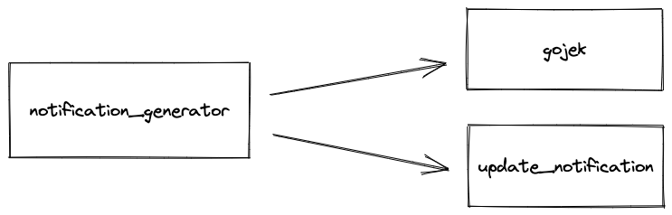
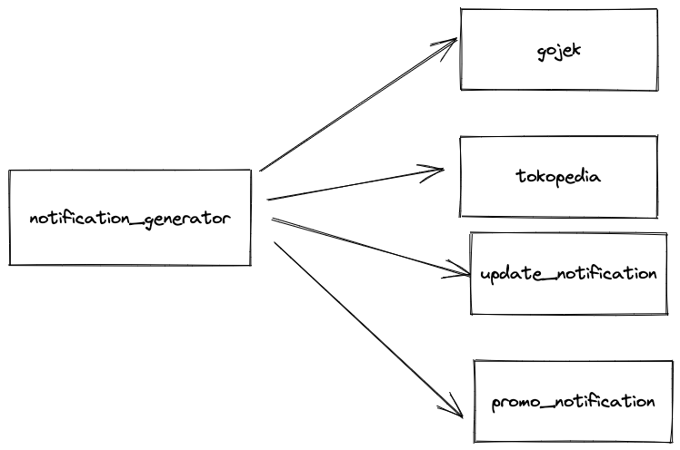
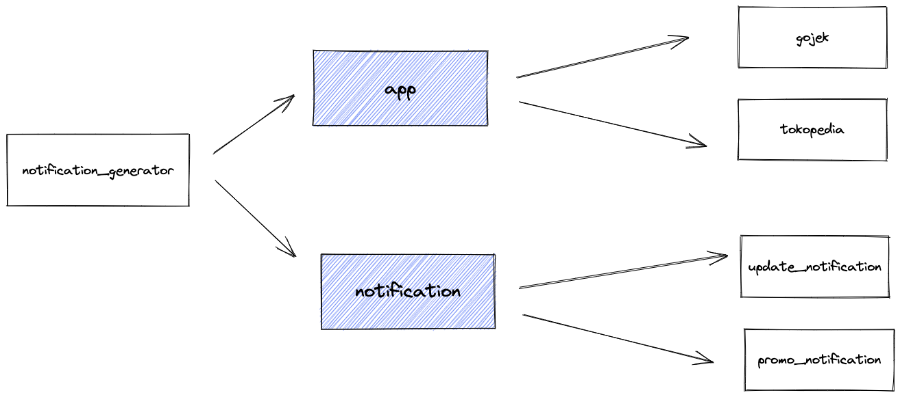

# SOLID Principles - 2

## Recap

In the previous class we discussed about about the first two solid principles namely - 

1. Single Responsibility Principle
2. Open/Closed Principle

Now we will discuss the remaining ones.

## L - Liskov Substitution Principle

Liskov Substitution Principle states that you should always be able to substitute the parent class with it's derived class without any undesirable behaviour.

__Let's use some coding examples to understand further__

Here is a code snippet that has a class `Rectangle` and a method `calculate_area`to calculate the area of the rectangle.

```ruby
class Rectangle
  attr_accessor :length, :width
  
  def calculate_area
    width * length
  end
end
```


Let's also implement a class `Square` which is a child of `Rectangle` as all squares are basically rectangles with length and width equal to each other.

So the square class will look something like this.

```ruby
class Square < Rectangle
  def width=(width)
    super(width)
    @length = width
  end
  
  def length=(length)
    super(length)
    @width = length
  end
end
```

Following code will run just fine - 

```ruby
require './rectangle'

describe Rectangle do 
 it "can calculate area" do
  rectangle = Rectangle.new
  rectangle.length = 10
  rectangle.width = 5
  expect(rectangle.calculate_area).to eq(50)
 end
  it "can calculate square area" do
  rectangle = Square.new
  rectangle.length = 10
  rectangle.width = 5
  expect(rectangle.calculate_area).to eq(25)
 end
end
```

__Anything wrong in the test code? 🤔__


```ruby
it "can calculate square area" do
rectangle = Square.new
rectangle.length = 10
rectangle.width = 5
expect(rectangle.calculate_area).to eq(25)
```

In the above mentioned code the behaviour for square is a little different as the value of length is replaced by width when we set `width = 5`. This unexpectedly behaviour on subclass means or abstraction is wrong.

### So what can be done?
1. Identify the common behaviour in both the clases and do not tie them down. We can create two seperate classes.
2. Add another layer of abstraction to "simulate" interface type.

__Let's write some code for it__

Define a class `Shape` that is a common class.
```ruby
class Shape
  def calculate_area
    raise NotImplementedError
  end
end
```

Both `Rectangle` and `Square` can now implement `Shape`.

class `Rectangle` will look something like this
```ruby
require_relative 'shape'

class Rectangle < Shape
  attr_accessor :length, :width
  
  def calculate_area
    width * length
  end
end
```

class `Square` will look something like this

```ruby
require_relative 'shape'

class Square < Shape
  attr_accessor :side_length
  
  def calculate_area
    side_length * side_length
  end
end

```

Two things happened this way - 

1. We clearly deined that `Shape` abstract class has a behaviour that is `calculate_area`
2. Class that extends this will have it's own implementation but will behave expectedly.


Summarising the Liskov Substitution Principle -
>*__If it looks like a duck, Quacks like a duck but need batteries - You probably have the wrong abstraction__*

### Hands On

Try to find what is wrong in this code and try to refactor.

We have an abstract class bird
```ruby
class Bird
  def sound
    raise NotImplementedError
  end
  def fly
    "I will fly!"
  end
end
```

Class `Ostrich` extends `Bird`
```ruby
require_relative 'bird'

class Ostrich < Bird
  def sound
    "bark"
  end
  def fly
    raise "I can't fly"
  end
end
```

Class `Duck` also implements `Bird`

```ruby
require_relative 'bird'

class Duck < Bird
  def sound
    "quack"
  end
end
```

```ruby
sam_bird = Duck.new
osma_bird = Ostrich.new

sam_bird.fly
osma_bird.fly
```

Try firguring out what's wrong with the above code and use __Open/Closed Principle__ to improve it.


## I - Interface Segregation Principle

### Interface
An Interface is a description of the actions that an object can do. For Example when you flip the light switch, the light goes on. You don't care how? Just that it does. 

In Object Oriented Programming, an interface is a description of all functions that an object must have in order to be `X`. Anything that acts like a light should have `turn_on` and `turn_off` method. The purpose of interface is to allow the computer to enforce properties and to know that an object of type `T`(some interface) must have functions X, Y, Z etc.

In Java, an interface is an abstract class that is used to group related methods with empty bodies. To implement an interface, classes should implement all of its methods.

__Let's see some code__

Let's define an interface `MediaPlayer` that does two things, `playAudio` and `playVideo`.
```java
public interface MediaPlayer {
    public void playAudio();
    public void playVideo();
}
```

This interface is implemented by two media players namely `VLCMediaPlayer` and `WinampMediaPLayer`.

```java
public class VLCMediaPlayer implements MediaPlayer {
    @Override
    public void playAudio() {
        System.out.println(" Playing audio ..........");
    }

    @Override
    public void playVideo() {
        System.out.println(" Playing video ..........");
    }
}

public class WinampMediaPlayer implements MediaPlayer {
    @Override
    public void playVideo() {
        throw new VideoUnsupportedException();
    }

    @Override
    public void playAudio() {
        System.out.println("Playing audio ..............");
    }
}
```

#### Public Interfaces

Any `methods` that you expose to other classes are public interfaces. Therefore, they should:

- Reveal their primary responsibility.
- Expect to be invoked by others.
- Will not change on a whim.
- Be safe for others to depend on.
- Be documented in tests

#### Private Interfaces

All other `methods`in the class are part of its private interface. They should:

- Handle implementation details.
- Not be expected to be sent by other objects.
- Can change for any reason.
- Be unsafe for others to depend on.
- Not referenced in the tests.

## D - Dependency Inversion Principle

Let's look at some code.

```ruby
class NotificationGenerator
 def generate_wording
  app = Gojek.new
  notif = UpdateNotification.new

  "#{app.app_name} #{notif.wording}"	
 end
end

class Gojek
 def app_name
  "Gojek"
 end
end

class UpdateNotification
 def wording
  "has new update!"
 end
end
```

We have a class `NotificationGenerator` that generates a notification.
Looking at the method `generate_wording` we can say that it depends on object of classes `Gojek` and `UpdateNotification`.

This is how the dependency graph looks like


__Enters the Project Manager(yet again...😒)__


The project manager comes with the following requirements - 

- We need to have promo notification for Gojek.
- We need to add new app name such as Tokopedia.

If we don't want to change this design we will need to add more method for each app and notification type on our notification_generator class. That means....

More and more dependencies ....😭

Our code might look something like this 

```ruby
class NotificationGenerator
 def generate_gojek_update_wording
  app = Gojek.new
  notif = UpdateNotification.new

  "#{app.app_name} #{notif.wording}"	
 End


 def generate_tokopedia_update_wording
  app = Tokopedia.new
  notif = UpdateNotification.new

  "#{app.app_name} #{notif.wording}"	
 end


 def generate_gojek_promo_wording
  app = Gojek.new
  notif = PromoNotification.new

  "#{app.app_name} #{notif.wording}"	
 end
end
```

So `NotificationGenerator` depends on classes `Gojek`, `Tokopedia`, `UpdateNotification` and `PromoNotification`

Our dependency graph looks like this



Imagine adding more types of wording or more apps 🌋

__Dependency Inversion Principle__ to the rescue, it states that high level modules should not depend on low level modules and both should depend on abstractions. Abstraction should not depend on details but details should depend upon abstractions.

*Let's refactor some code to understand things better*

So rather than creating objects inside the method we pass them as params(__injection__).

```ruby
class NotificationGenerator
 def generate_wording(app, notif)
  "#{app.app_name} #{notif.wording}"	
 end
end
```


Testing code
```ruby
require './notification'

describe NotificationGenerator do 
 it "can generate notification" do
  notif = NotificationGenerator.new

  app = Gojek.new
  notif_type = UpdateNotification.new 

  expect(notif.generate_wording(app, notif_type)).to eq("Gojek has new update!")

 end
end
```

Here we create the objects before calling `generate_wording` and inject them. In our case `app` and `notif` are the abstractions. 

__Note__ - Don't forget that the abstraction must have the required interface.

Let's do that!

We have our `NotificationGenerator` that depends on `app` and `notification`.
```ruby
class NotificationGenerator
 def generate_wording(app, notification)
  "#{app.app_name} #{notification.wording}"
 end
end
```

Let's define an abstract class `App`
```ruby
class App
 def app_name
  raise NotImplementedError
 end
end
```

The first method param can be any implementation of class `App`

So let's define the `Gojek` implementation
```ruby
require_relative 'app'

class Gojek < App
 def app_name
  "Gojek"
 end
end
```

Similarly we can define a `Notification` abstraction.
```ruby
class Notification
 def wording
  raise NotImplementedError
 end
end
```

We can create two implementation of `Notification` namely `UpdateNotification` and `PromoNotification`.

```ruby
require_relative 'notification'

class UpdateNotification < Notification 
 def wording
  "has new update!"
 end
end
```

```ruby
require_relative 'notification'

class PromoNotification < Notification 
 def wording
  "has new promo!"
 end
end
```

Now our dependency graph looks like this



This makes the code easier to use and it's not coupled to low level modules.

Few examples

```ruby
notif.generate_wording(Gojek.new, UpdateNotification.new)

notif.generate_wording(Tokopedia.new, UpdateNotification.new)

notif.generate_wording(Gojek.new, PromoNotification.new)
```

### Hands On

We have a `Copier` class that reads from `KeyboardReader` and copies to `Printer`.

```ruby
class Copier
	def copy(input)
		reader = KeyboardReader.new
		writer = Printer.new

		reader.read(input)
		writer.write(input, reader.name)
	end
end

class Printer
	def write(input, reader_name)
		"printer prints '#{input}' from #{reader_name}"
	end
end

class KeyboardReader
	def name
		"keyboard"
	end
	def read(input)
		"keyboard read #{input}"
	end
end

```

How can you make `Copier` more extensible so that we can use `Scanner` to read and paste it to `PrinterReader` without adding more dependencies?

---
# Homework
Apply the principles you have learnt in your project
